# microservices-03
Домашнее задание к занятию «Микросервисы: подходы»

Задача 1: Обеспечить разработку
Предложите решение для обеспечения процесса разработки: хранение исходного кода, непрерывная интеграция и непрерывная поставка. Решение может состоять из одного или нескольких программных продуктов и должно описывать способы и принципы их взаимодействия.

Решение должно соответствовать следующим требованиям:

> Вопрос: -->>: облачная система;

Используем облачную платформу Yandex Cloud.

Обоснование:

Облачная модель (IaaS + PaaS) обеспечивает масштабируемость и отказоустойчивость без необходимости управления физической инфраструктурой.  Это независимая  геораспределенная отказоустойчивая система.
Наличие managed-сервисов (например, Kubernetes, базы данных, балансировщики) ускоряет внедрение микросервисной архитектуры.
Поддержка геораспределённых зон доступности повышает устойчивость системы.

Вывод:
Выбор облака позволяет быстро развернуть CI/CD инфраструктуру, обеспечить масштабирование и снизить эксплуатационные затраты.
* Российские облачные провайдеры:
    - Yandex Cloud: Предоставляет, например, Yandex Managed Service for Kubernetes для управления Docker-контейнерами.
    - Selectel: Предлагает облачную инфраструктуру и инструменты для работы с контейнерами.
    - Dataline
    - IBS 

> Вопрос: -->>: система контроля версий Git;
Используем GitLab, развернутый в облаке (self-hosted).

Обоснование:

Поддержка Git как системы контроля версий.
Встроенный CI/CD (GitLab CI).
Централизованное хранение кода, пайплайнов и настроек.
Гибкая модель прав доступа.

Вывод:
GitLab покрывает сразу несколько требований (VCS + CI/CD), что снижает сложность архитектуры.

> Вопрос: -->>:  репозиторий на каждый сервис;
    Каждый сервис в виде - это отельный репозиторий, потому чтобы минимизировать зависимости, изменение или обновление микросервиса не повлияет на окружение, потому что есть основные входные и выходные параметры, которые выполняет и обслуживает микросервис.
    Каждый микросервис размещается в отдельном Git-репозитории.

Обоснование:

Независимость разработки и релизов.
Возможность отдельного CI/CD пайплайна.
Минимизация конфликтов между командами.
Изоляция изменений.

Вывод:
Такой подход соответствует принципам микросервисной архитектуры и упрощает масштабирование команд.
    
> Вопрос:  запуск сборки по событию из системы контроля версий;
Используются GitLab CI pipeline, запускаемые по событиям:

    push в ветку
    merge request
    создание тега

Обоснование:

Автоматическая проверка кода при каждом изменении.
Раннее выявление ошибок.
Поддержка практики Continuous Integration.

Вывод:
Событийная модель запуска обеспечивает стабильность и качество кода.

> Вопрос:  запуск сборки по кнопке с указанием параметров;
 Используются manual jobs в GitLab CI с переменными (CI/CD variables).

Обоснование:

Возможность ручного запуска для:
деплоя в Production
hotfix
экспериментальных сборок
Передача параметров (окружение, версия, флаги).

Вывод:
Ручной запуск необходим для контролируемых операций и снижает риск ошибок при выкатке в прод.

> Вопрос:  возможность привязать настройки к каждой сборке;
Используются:

    переменные окружения (CI/CD variables)
    параметры pipeline
    тегирование и указание версии

Обоснование:

Каждая сборка может иметь уникальную конфигурацию.
Возможность воспроизводимости сборок.
Разделение настроек по окружениям (dev/test/prod).

Вывод:
Это обеспечивает гибкость и контроль конфигураций.

> Вопрос:  возможность создания шаблонов для различных конфигураций сборок;
Используются:

    .gitlab-ci.yml шаблоны
    include/extends механизмы GitLab CI

Обоснование:

Повторное использование конфигураций.
Унификация процессов сборки.
Упрощение поддержки CI/CD.

Вывод:
Шаблоны уменьшают дублирование и повышают стандартизацию.

> Вопрос:  возможность безопасного хранения секретных данных (пароли, ключи доступа);
Используются:

    GitLab CI/CD Variables (masked, protected)
    интеграция с HashiCorp Vault (опционально)

Обоснование:

Секреты не хранятся в коде.
Ограничение доступа по ролям.
Шифрование и аудит доступа.

Вывод:
Безопасное хранение секретов является критически важным требованием для CI/CD.

> Вопрос:  несколько конфигураций для сборки из одного репозитория;
Используются:

    разные pipeline (branches, tags)
    условия (rules, only/except)
    переменные окружения

Обоснование:

Один сервис может иметь:
    dev-сборку
    тестовую сборку
    production-сборку
    Разные параметры и шаги для каждого окружения.

Вывод:
Позволяет использовать один репозиторий для разных сценариев сборки.

> Вопрос:  кастомные шаги при сборке;
Реализуются через pipeline stages:

    build
    test
    lint
    security scan
    deploy

Обоснование:

Возможность добавлять любые этапы:
    статический анализ
    интеграционные тесты
    проверка безопасности

Вывод:
  Гибкость пайплайна позволяет адаптировать процесс под требования проекта.

> Вопрос:  собственные докер-образы для сборки проектов;
Используются кастомные Docker-образы, хранящиеся в GitLab Container Registry.

Обоснование:

  Контроль окружения сборки.
  Предустановленные зависимости.
  Ускорение CI (нет повторной установки пакетов).

Вывод:
Это повышает воспроизводимость и скорость сборок.

> Вопрос:  возможность развернуть агентов сборки на собственных серверах;
Используются GitLab Runner:

    shared runners (в облаке)
    self-hosted runners (на собственных серверах)

Обоснование:

Возможность выполнения задач внутри защищённой сети.
Доступ к внутренним ресурсам.
Гибкое масштабирование.

Вывод:
Self-hosted runners необходимы для гибкости и безопасности.

> Вопрос:  возможность параллельного запуска нескольких сборок;
Поддерживается GitLab CI:

    параллельные jobs
    масштабирование runners

Обоснование:

Ускорение разработки.
Одновременная работа нескольких команд.

Вывод:
Параллелизм критичен для высокой скорости разработки.

> Вопрос:  возможность параллельного запуска тестов.
Используются:

  parallel jobs
  matrix strategy

Обоснование:

Разделение тестов (unit, integration, e2e).
Запуск на разных окружениях.

Вывод:
Сокращает время обратной связи разработчику.

> Итоговый вопрос:  Обоснуйте свой выбор.
* Выбранное решение на базе GitLab CI/CD и Yandex Cloud соответствует всем требованиям:

   - обеспечивает полный цикл CI/CD в одной платформе;
   - поддерживает микросервисный подход (раздельные репозитории и пайплайны);
   - позволяет гибко управлять конфигурациями и окружениями;
   - обеспечивает безопасность (секреты, доступы);
   - масштабируется горизонтально (runners, облачная инфраструктура);
   - поддерживает автоматизацию и ручное управление процессами.

Итоговый вывод:
      Выбранная архитектура является сбалансированной по критериям:
надежность, масштабируемость, безопасность и удобство сопровождения, что делает её подходящей для крупной компании с микросервисной архитектурой.

Задача 2: Логи
Предложите решение для обеспечения сбора и анализа логов сервисов в микросервисной архитектуре. Решение может состоять из одного или нескольких программных продуктов и должно описывать способы и принципы их взаимодействия.

Решение должно соответствовать следующим требованиям:
> Вопрос: -->>: сбор логов в центральное хранилище со всех хостов, обслуживающих систему;

Используется стек:

  Elasticsearch — центральное хранилище логов
  Logstash или Fluentd — обработка логов
  Filebeat — агент сбора логов

Обоснование:

  Агенты (Filebeat) устанавливаются на каждый хост и собирают логи.
  Логи отправляются в централизованное хранилище (Elasticsearch).
  Поддерживается горизонтальное масштабирование.

Вывод:
Централизация логов упрощает мониторинг и диагностику всей системы.

> Вопрос: -->>: минимальные требования к приложениям, сбор логов из stdout;

Используется подход:

    приложения пишут логи в stdout/stderr
    сбор осуществляется через Filebeat / Fluentd

Обоснование:

  Не требуется изменять код приложений.
  Соответствие принципам 12-factor app.
  Упрощение разработки и сопровождения.

Вывод:
Минимальные требования к приложениям позволяют стандартизировать логирование.


> Вопрос: -->>: гарантированная доставка логов до центрального хранилища;

Используются:

    буферизация в Filebeat / Fluentd
    очередь сообщений (опционально) — Apache Kafka

Обоснование:

  При недоступности Elasticsearch логи не теряются.
  Kafka обеспечивает:
  отказоустойчивость
  репликацию
  гарантированную доставку

Вывод:
Использование промежуточного брокера повышает надёжность системы логирования.

> Вопрос: -->>: обеспечение поиска и фильтрации по записям логов;

Используется Elasticsearch.

Обоснование:

    Индексация логов в near real-time.
    Поддержка полнотекстового поиска.
    Фильтрация по полям (уровень логов, сервис, время).

Вывод:
  Elasticsearch обеспечивает быстрый и гибкий поиск по большим объёмам данных.

> Вопрос: -->>: обеспечение пользовательского интерфейса с возможностью предоставления доступа разработчикам для поиска по записям логов;

    Используется Kibana.

Обоснование:

  Web-интерфейс для поиска и анализа логов.
  Возможность настройки дашбордов.
  Управление доступами (RBAC).

Вывод:
Kibana предоставляет удобный интерфейс для разработчиков и DevOps-инженеров.

> Вопрос: -->>: возможность дать ссылку на сохранённый поиск по записям логов;

Используется функциональность Saved Objects в Kibana.

Обоснование:

    Можно сохранять поисковые запросы.
    Генерация URL для доступа к результатам.
    Использование в расследованиях инцидентов.

Вывод:
  Это упрощает совместную работу и ускоряет анализ проблем.

> Итоговый вопрос: Обоснуйте свой выбор.

Выбран стек ELK (Elasticsearch + Logstash/Fluentd + Kibana) с использованием Filebeat и опционально Kafka, так как он:

  - обеспечивает централизованный сбор логов со всех сервисов;
  - не требует изменений в приложениях (stdout);
  - гарантирует доставку данных (буферы + брокер сообщений);
  - предоставляет мощные возможности поиска и фильтрации;
  - имеет удобный пользовательский интерфейс;
  - поддерживает масштабирование и отказоустойчивость;
  - позволяет делиться результатами анализа через сохранённые запросы.

Итоговый вывод:
  Данное решение является промышленным стандартом для микросервисной архитектуры, так как сочетает надёжность, масштабируемость и удобство работы с логами.

Задача 3: Мониторинг
Предложите решение для обеспечения сбора и анализа состояния хостов и сервисов в микросервисной архитектуре. Решение может состоять из одного или нескольких программных продуктов и должно описывать способы и принципы их взаимодействия.

Решение должно соответствовать следующим требованиям:

>Вопрос: -->>: сбор метрик со всех хостов, обслуживающих систему;

Используется стек:

    Prometheus — сбор и хранение метрик
    Node Exporter — сбор метрик хостов

Обоснование:

  Node Exporter устанавливается на каждый хост и предоставляет метрики.
  Prometheus по pull-модели регулярно опрашивает все хосты.
  Автоматическое обнаружение целей (service discovery).

Вывод:
Централизованный сбор метрик обеспечивает единое представление состояния системы.

> Вопрос: -->>: сбор метрик состояния ресурсов хостов: CPU, RAM, HDD, Network;

Используется Node Exporter.

Обоснование:

    Предоставляет стандартные системные метрики:
    загрузка CPU
    использование памяти
    дисковая подсистема
    сетевые интерфейсы
    Не требует доработки хостов.

Вывод:
  Node Exporter является стандартным инструментом для мониторинга инфраструктуры.

> Вопрос: -->>: сбор метрик потребляемых ресурсов для каждого сервиса: CPU, RAM, HDD, Network;

Используются:

    cAdvisor — метрики контейнеров
    Kube State Metrics (при использовании Kubernetes)

Обоснование:

  cAdvisor собирает метрики использования ресурсов контейнерами.
  Kube State Metrics предоставляет информацию о состоянии объектов Kubernetes.
  Позволяет отслеживать нагрузку на каждый микросервис.

Вывод:
Разделение метрик по сервисам необходимо для диагностики и масштабирования.

> Вопрос: -->>: сбор метрик, специфичных для каждого сервиса;

Используется:

    встроенная инструментализация приложений
    клиентские библиотеки Prometheus Client Libraries

Обоснование:

  Приложения экспортируют метрики через HTTP endpoint (/metrics).
  Возможность сбора:
  бизнес-метрик (например, количество запросов)
  технических метрик (latency, error rate)

Вывод:
Кастомные метрики позволяют глубже анализировать поведение сервисов.

> Вопрос: -->>: пользовательский интерфейс с возможностью делать запросы и агрегировать информацию;

Используется:

    Prometheus (PromQL)
    Grafana

Обоснование:

  PromQL позволяет выполнять сложные запросы и агрегации.
  Grafana предоставляет удобный UI для работы с метриками.

Вывод:
Комбинация Prometheus + Grafana обеспечивает мощный аналитический инструмент.

> Вопрос: -->>: пользовательский интерфейс с возможностью настраивать различные панели для отслеживания состояния системы;

Используется Grafana.

Обоснование:

  Создание дашбордов:
      по сервисам
      по хостам
      по окружениям
  Поддержка шаблонов (templating).
    Возможность совместного использования дашбордов.

Вывод:
Grafana является стандартом визуализации метрик в индустрии.

> Итоговый вопрос: Обоснуйте свой выбор.

* Выбран стек Prometheus + Node Exporter + cAdvisor + Grafana (опционально Kube State Metrics), так как он:

  -  обеспечивает сбор метрик со всех уровней (хосты, контейнеры, сервисы);
  -  поддерживает масштабируемость и микросервисную архитектуру;
  -  использует pull-модель, упрощающую контроль доступности источников;
  -  позволяет собирать как системные, так и бизнес-метрики;
  -  предоставляет мощные средства агрегации и анализа (PromQL);
  -  имеет удобный и гибкий интерфейс визуализации (Grafana);
  -  широко используется в индустрии и имеет развитую экосистему.

Итоговый вывод:
Данное решение является промышленным стандартом мониторинга микросервисов и обеспечивает полный контроль состояния системы, что позволяет своевременно выявлять и устранять проблемы.

Приступмс к задаче № Задача 4: Логи
Продолжить работу по задаче API Gateway: сервисы, используемые в задаче, пишут логи в stdout.
Добавить в систему сервисы для сбора логов Vector + ElasticSearch + Kibana со всех сервисов, обеспечивающих работу API.

У нас есть уже готовый стенд из DZ-02-microservices, скопируем его и дополним.

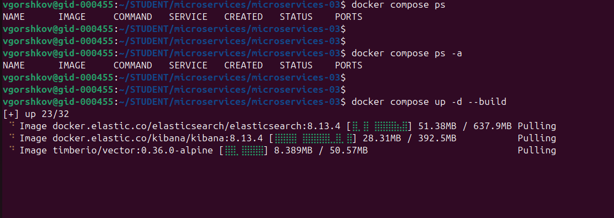

Траблшутинг - закончилось место на диске, блокировка шардов.
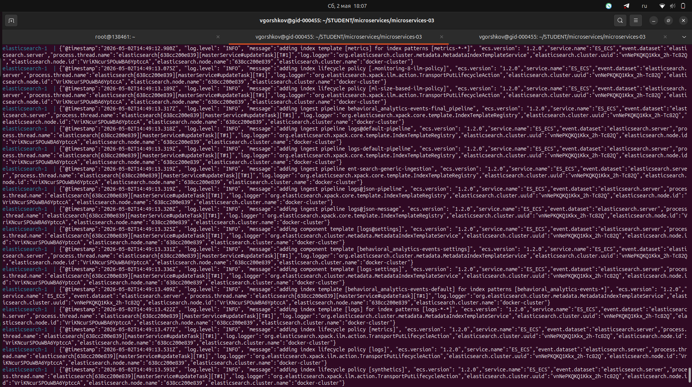

Загружаю ДЗ и перехожу в траблшутинг.

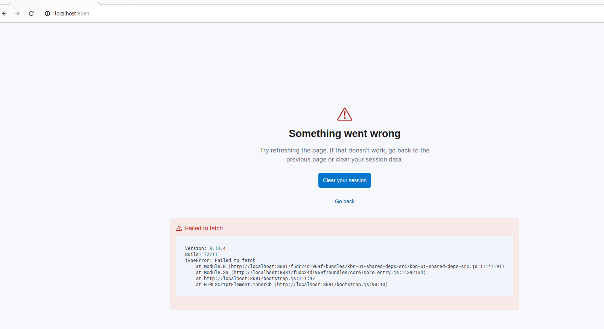

Проверяем и используем токены
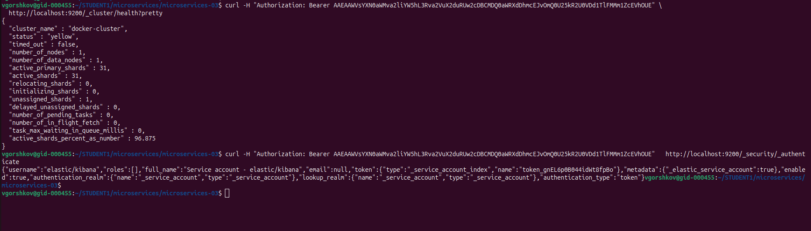

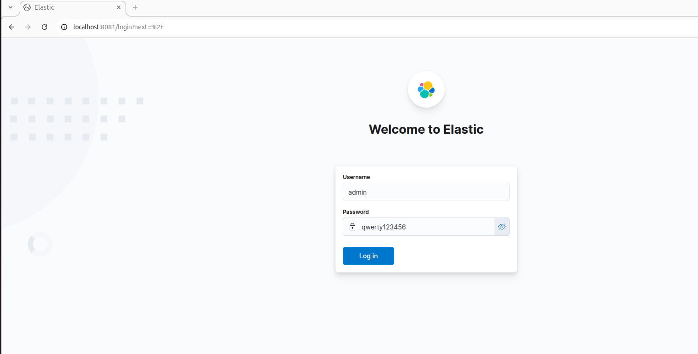

Создадим пользователя через curl
```


vgorshkov@gid-000455:~/STUDENT1/microservices/microservices-03$ curl -u elastic:qwerty123456 \
  -X POST "http://localhost:9200/_security/user/admin" \
  -H "Content-Type: application/json" \
  -d '{
    "password": "qwerty123456",
    "roles": ["superuser"],
    "full_name": "Admin User"
  }'
{"created":true}vgorshkov@gid-000455:~/STUDENT1/microservices/microservices-03$ 
vgorshkov@gid-000455:~/STUDENT1/microservices/microservices-03$ 
vgorshkov@gid-000455:~/STUDENT1/microservices/microservices-03$ curl -u elastic:qwerty123456 \
  http://localhost:9200/_security/user/admin
{"admin":{"username":"admin","roles":["superuser"],"full_name":"Admin User","email":null,"metadata":{},"enabled":true}}vgorshkov@gid-000455:~/STUDENT1/microservices/microservices-03$ 
vgorshkov@gid-000455:~/STUDENT1/microservices/microservices-03$ 

```
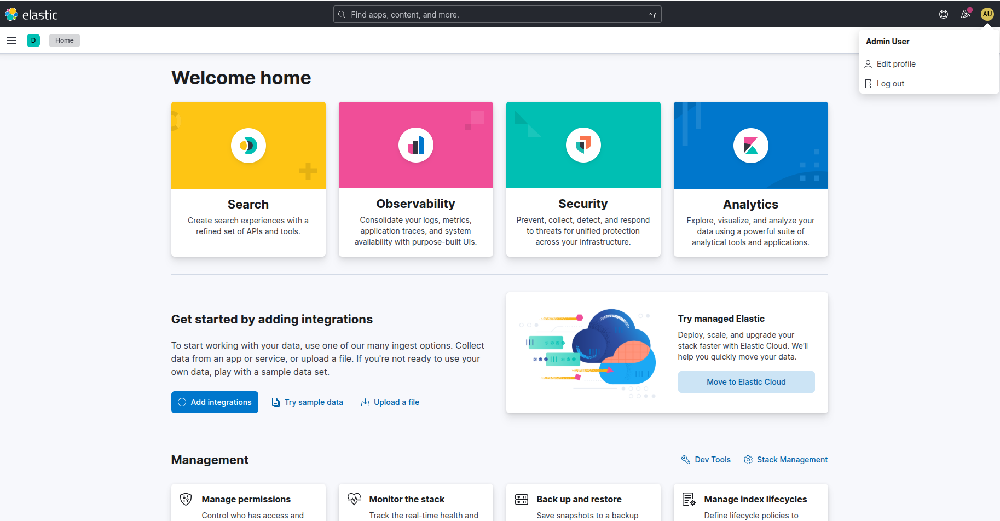

Готово.
docker compose файл, запустив который можно перейти по адресу http://localhost:8081, по которому доступна Kibana. Логин в Kibana должен быть admin, пароль qwerty123456.

Задача № 5: Мониторинг * (необязательная)
Продолжить работу по задаче API Gateway: сервисы, используемые в задаче, предоставляют набор метрик в формате prometheus:

  сервис security по адресу /metrics,
  сервис uploader по адресу /metrics,
  сервис storage (minio) по адресу /minio/v2/metrics/cluster.

Добавить в систему сервисы для сбора метрик (Prometheus и Grafana) со всех сервисов, обеспечивающих работу API. Построить в Graphana dashboard, показывающий распределение запросов по сервисам.

Результат выполнения:
docker compose файл, запустив который можно перейти по адресу http://localhost:8081, по которому доступна Grafana с настроенным Dashboard. Логин в Grafana должен быть admin, пароль qwerty123456.

Elastic
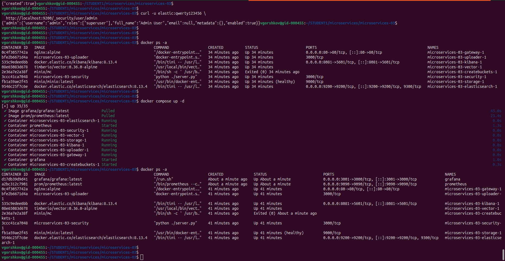

Grafana
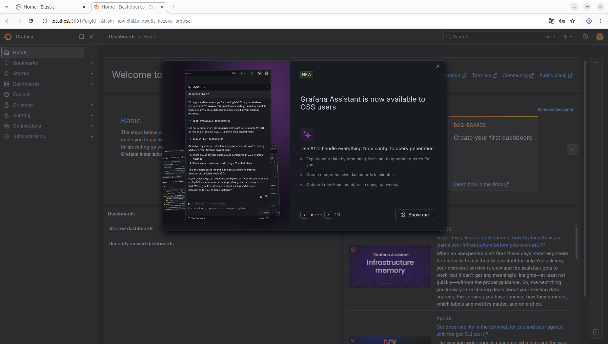

Prometeus
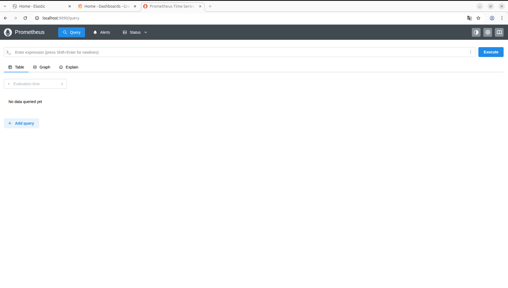

Kibana
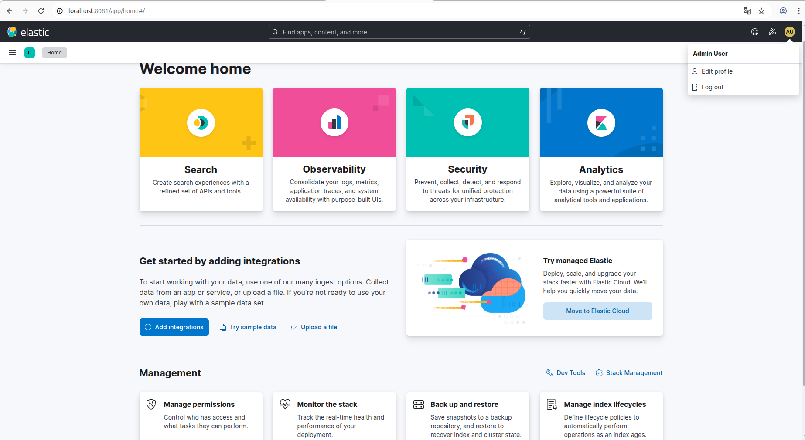

Переходим в Stack Management
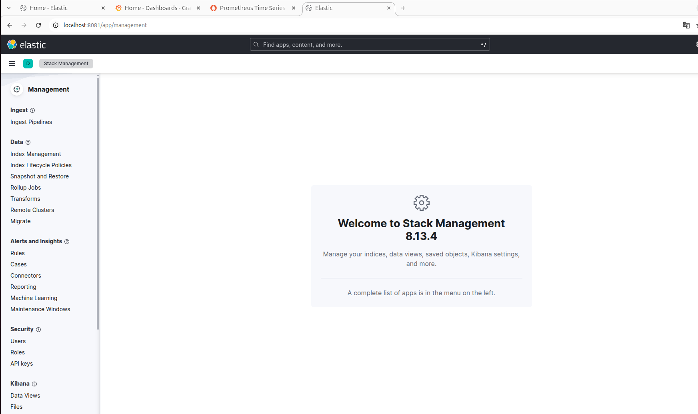

Добавили prometeus в конектор Графане
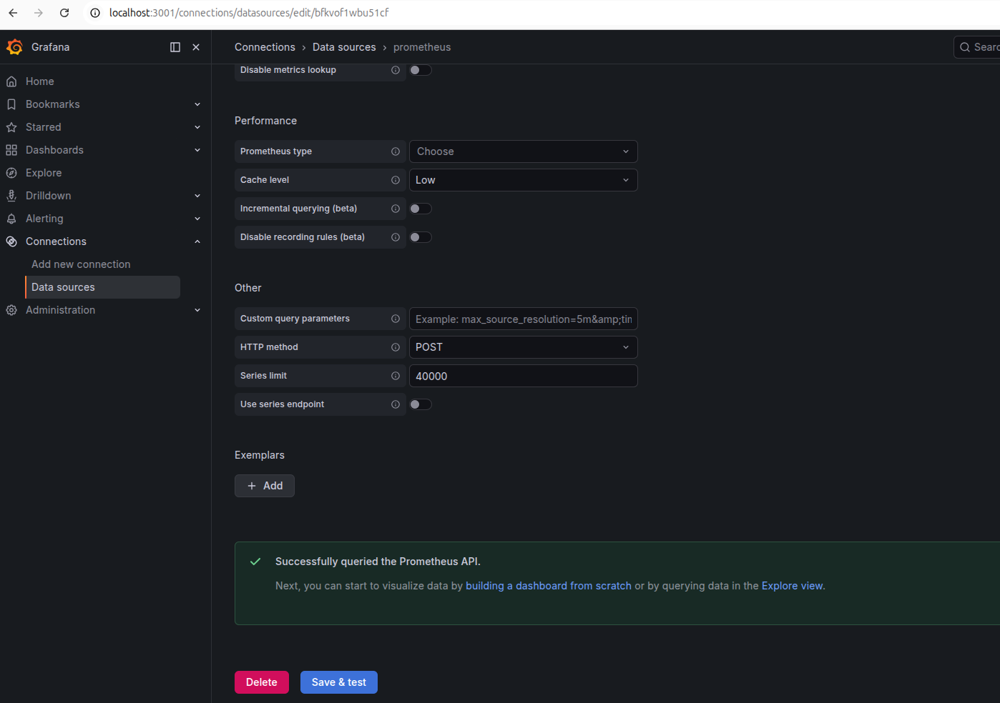

Видим метрики
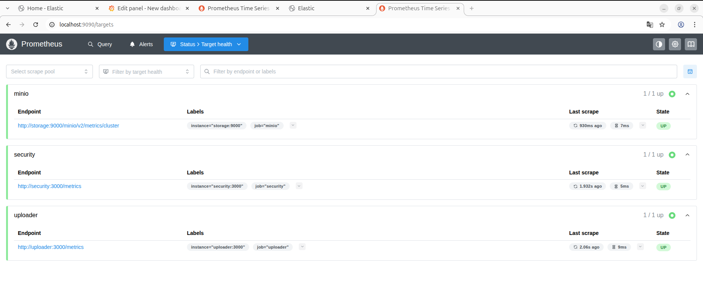

Строим графики
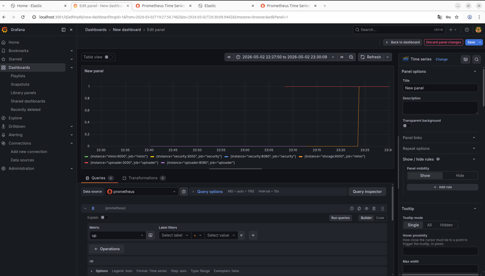

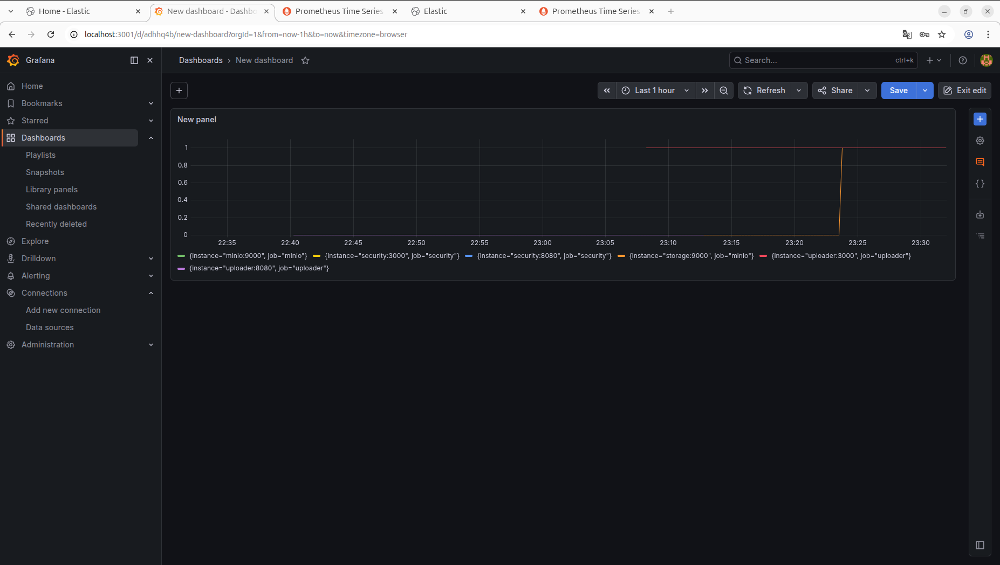

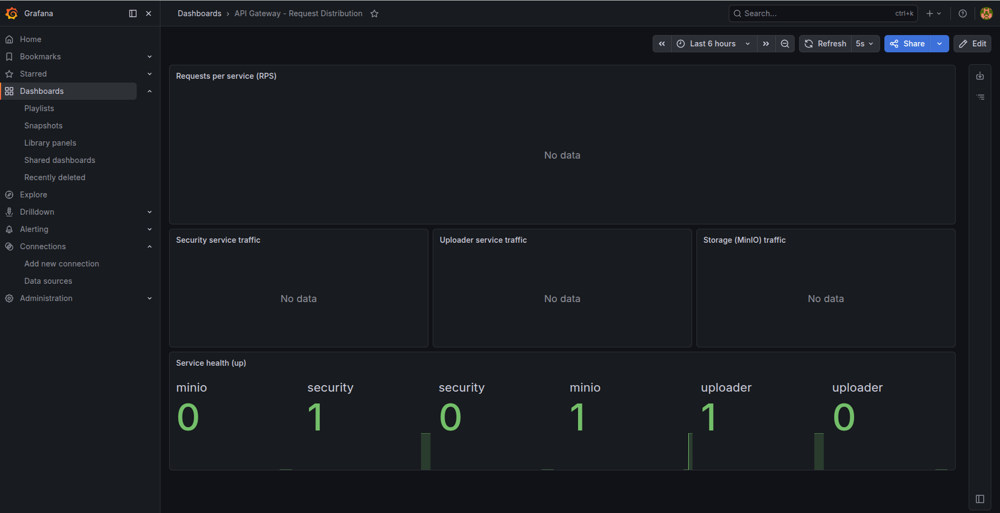


